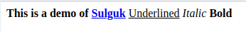
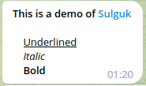
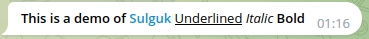

Sulguk - HTML to telegram entities converter
================================================

Need to deliver formatted content to your bot clients?
Having a hangover after trying to fit HTML into telegram?
Beautifulsoup is too complicated and not helping with messages?

Try `sulguk` (술국, a hangover
soup) - [delivered since 1800s](https://en.wikipedia.org/wiki/Food_delivery).

## Problem

Telegram supports `parse_mode="html"`, but:

* Telegram processes spaces and new lines incorrectly. So we cannot format HTML source for more readability.
* Amount of supported tags is very low 
* It does not ignore additional attributes in supported tags.

Let's imagine we have HTML like this:

```html
<b>This is a demo of <a href="https://github.com/tishka17/sulguk">Sulguk</a></b>

  <u>Underlined</u>
  <i>Italic</i>
  <b>Bold</b>
```

This is how it is rendered in browser (expected behavior):



But this is how it is rendered in Telegram with `parse_mode="html"`:



T osolve this we can convert HTML to telegram entites with `sulguk`. So that's how it looks now:



## Example

1. Create your nice HTML:

```html

<ol start="10">
    <li>some item</li>
    <li>other item</li>
</ol>
<p>Some <b>text</b> in a paragraph</p>
```

2. Convert it into text and entities

```python
result = transform_html(raw_html)
```

3. Send it to telegram.

Depending on your library you may need to convert entities from dict into
proper type

```python
await bot.send_message(
    chat_id=CHAT_ID,
    text=result.text,
    entities=result.entities,
    parse_mode="html",
)
```

## Example for aiogram users

1. Add `SulgukMiddleware` to your bot

```python
from sulguk.aiogram_middleware import SulgukMiddleware

bot.session.middleware(SulgukMiddleware())
```

2. Create your nice HTML:

```html

<ol start="10">
    <li>some item</li>
    <li>other item</li>
</ol>
<p>Some <b>text</b> in a paragraph</p>
```

3. Send it using `sulguk` as a `parse_mode`:

```python
from sulguk.data import SULGUK_PARSE_MODE

await bot.send_message(
    chat_id=CHAT_ID,
    text=raw_html,
    parse_mode=SULGUK_PARSE_MODE,
)
```

## Supported tags:

* `<br/>`
* `<hr/>`
* `<ul>`
* `<ol>` - with optional attributes
    * `reversed` - to reverse numbers order
    * `type` (`1`/`a`/`A`/`i`/`I`) - to set numbering style
    * `start` - to set starting number
* `<li>` - with optional  `value` attribute to change number. Nested lists have
  indentation
* `<a>`
* `<b>`, `<strong>`
* `<i>`, `<em>`
* `<s>`, `<strike>`, `<del>`
* `<div>` - to make a block (not inline) element
* `<span>` - to make an inline element, attribute class `tg-spoiler` is
  optional
* `<tg-spoiler>`
* `<p>` - to make a paragraph, emphasized with empty lines
* `<u>`
* `<q>` - to add quote signs around the text
* `<blockquote>` - like a paragram, but with indentation
* `<h1>`-`<h6>` - processed, but styled using available telegram options

Unsupported tags are raising an error.